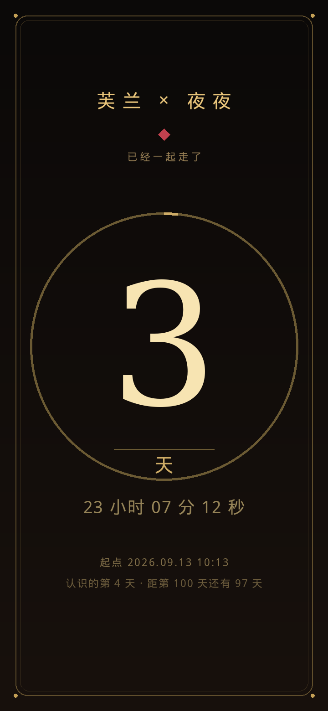
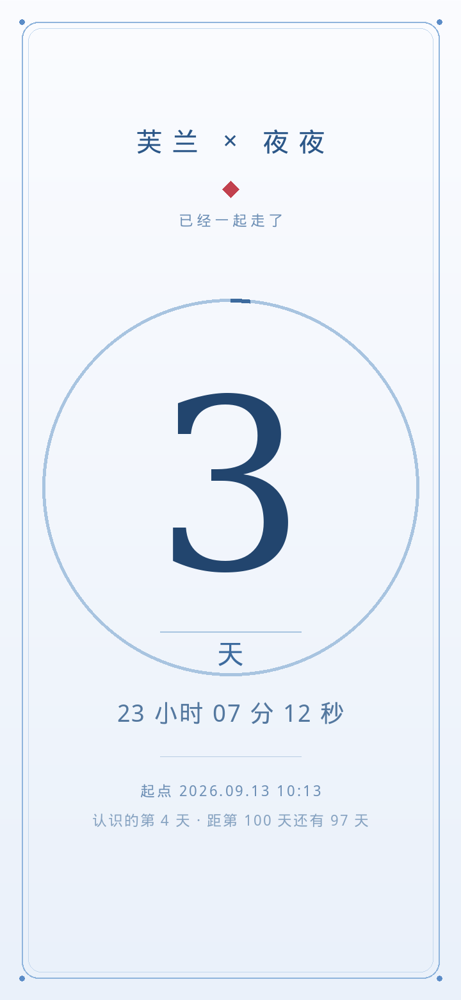
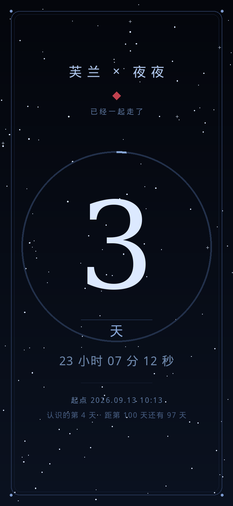
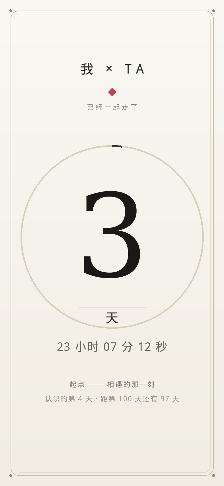

# 相爱

一个只做一件事的小软件：**告诉你，你们已经一起走了多久。**

给两个人用——你和那个你想记住的人。

**支持：安卓 5.0 及以上** ｜ **零权限 · 不联网 · 数据只在本机**

## 它是什么

- 一屏，一个大数字：**你们真实走过的天数**（差一分钟不满一天，就不算一天）；
- 下面一行跳到秒；
- 每天到达"你们相遇的那个时刻"，数字会自己**滚一页**；
- 数字外面一圈细金环：**距离下一个整 100 天**的进度；
- **点一下数字**可以换单位：天 → 小时 → 分钟 → 秒；
- 可以设一个**重要日子**，那天它会替你说一句你想说的话；
- 每年到了相遇的那一天、那一刻，会有一个**小彩蛋**浮出来演一遍；
- 四套配色：暖金 / 白蓝 / 深夜·星轨 / 信纸·白昼，切换时会柔和过渡；
- 桌面**小组件**（点它的大数字还能换单位）、**分享卡片**、长按图标的快捷入口。

## 它不做什么（这几条才是它最值钱的地方）

- **不申请任何权限**——安装时系统什么都不会问你；
- **不联网**——手机断网照样用；
- 不收集、不上传任何数据，**你填的名字和时间只存在这台手机里**；
- 没有账号、没有广告、没有后台进程。

## 安装

1. 下载 [`相爱-2.0.0.apk`](相爱-2.0.0.apk)；
2. 点开安装；系统会提示"未知来源 / Play 保护"，允许这一次就好；
3. 第一次打开，点**屏幕左上角那个很淡的小齿轮**，把名字和相遇时间改成你们的。

更细的说明见 [使用说明.md](使用说明.md)。

## 校验与签名

下载后可以核对（确认包没被人换过）：

- **安装包 SHA-256**：见 [SHA256SUMS.txt](SHA256SUMS.txt)
- **签名证书 SHA-256**：`4367189ae71865195440960c096818ef67ba228e73551cba5ce29b44e40bc6cd`

## 支持我

如果喜欢，就支持我一下吧。坦白说，这对我是真的重要——是我能把下一件东西做出来的底气。

（App 里：设置 → 支持一下。）

## 关于

- 创作者：**芙兰朵露·斯卡雷特**（[@lei47076](https://twitter.com/lei47076)）
- 本软件按"现状"提供，使用条款见 [LICENSE](LICENSE)。

## 界面

| 暖金 | 白蓝 |
|---|---|
|  |  |

| 深夜 · 星轨 | 信纸 · 白昼 |
|---|---|
|  |  |
